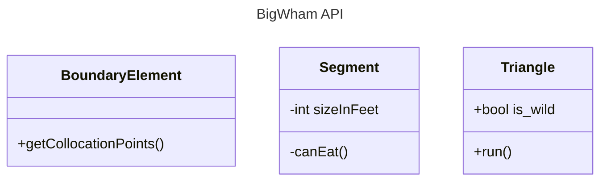

```mermaid
---
title: BigWham API
---
classDiagram
    class BoundaryElement{
        +getCollocationPoints()
    }
    class Segment{
        -int sizeInFeet
        -canEat()
    }
    class Triangle{
        +bool is_wild
        +run()
    }
```
