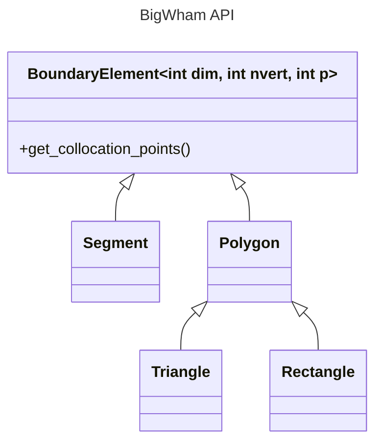

We are using [mermaid charts](https://mermaid.js.org/syntax/classDiagram.html) here.

## Boundary Element

```mermaid
---
title: BigWham API
---
classDiagram
    class BoundaryElement~int dim, int nvert, int p~{
        +get_collocation_points()
    }
    class Segment{
    }
    class Triangle{
    }
    class Polygon{
    }
    BoundaryElement <|-- Segment
    BoundaryElement <|-- Polygon
    Polygon <|-- Triangle
    Polygon <|-- Rectangle

```

## Mesh

## Kernel

## Hmatix

## IO
